<h1 align="center">基于Spring Boot 的校园外卖服务平台系统【带论文】</h1>

- <b>完整代码获取地址：从戎源码网 ([https://armycodes.com/](https://armycodes.com/))</b>
- <b>技术探讨、资料分享，请加QQ群：692619798</b>
- <b>作者微信：19941326836  QQ：3645296857</b>
- <b>承接计算机毕业设计、Java毕业设计、Python毕业设计、深度学习、机器学习</b>
- <b>选题+开题报告+任务书+程序定制+安装调试+论文+答辩ppt 一条龙服务</b>
- <b>所有选题地址 ([https://github.com/Descartes007/allProject](https://github.com/Descartes007/allProject)) </b>

## 一、项目介绍

### 基于 Spring Boot 的校园外卖服务平台，系统角色为 管理员（后台）和 普通用户（前端），主要功能如下
### 管理员（后台）：
- 基本操作：登录、退出、重置密码、获取并修改个人信息
- 商品管理：筛选商品、获取商品分页列表、查看商品详情、新增商品、修改商品、逻辑删除
- 订单管理：筛选订单、获取订单分页列表、查看订单详情、新增订单、修改订单、删除订单、发货、收货、退款、订单评价管理
- 用户管理：筛选用户、获取用户分页列表、查看用户详情、新增用户、修改用户、删除用户、重置用户密码
- 购物车管理：分页列表、查看详情、新增、修改、删除
- 评论管理：分页列表、查看详情、新增、修改、删除、前端评价审核/管理
- 收藏管理：分页列表、查看详情、新增、修改、删除、
- 收货地址管理：分页列表、查看详情、新增、修改、删除、设置默认地址
- 公告管理：分页列表、查看详情、新增、修改、删除
### 普通用户（前端）：
- 基本操作：注册、登录、退出、忘记/重置密码、获取当前登录用户信息（session）
- 商品浏览：查看商品列表（排序/分页）、查看商品详情、商品点击计数
- 购物车：添加到购物车、查看购物车、修改购物车、删除购物车项
- 下单与支付：提交订单（支持余额/积分、按会员等级折扣计算）、库存校验、扣款与积分变更、查看订单列表与订单详情
- 订单操作：取消/退款、确认收货、查看物流信息（发货/收货）、对已收货订单评价
- 收藏与评价：收藏商品、查看/新增评价
- 收货地址：新增/修改/删除地址、设置默认地址

## 二、项目技术

- 编程语言：Java（后端）
- 项目架构：B/S 架构
- 前端技术：Vue 2.x、vue-router、Element UI、Axios、Webpack / Vue CLI
- 后端技术：Spring Boot、Spring MVC、MyBatis / MyBatis-Plus、Token + Session 会话机制、FastJSON、MySQL

## 三、运行环境

- JDK版本：1.8及以上都可以
- 操作系统：Windows7/10、MacOS
- 开发工具：IDEA、Ecplise、MyEclipse都可以

## 四、数据库配置文件

- npm版本：6.14.13及以上都可以
- Redis版本：3.2.100及以上都可以
- 文件名：application.yml
- 编码类型：utf8

## 论文截图

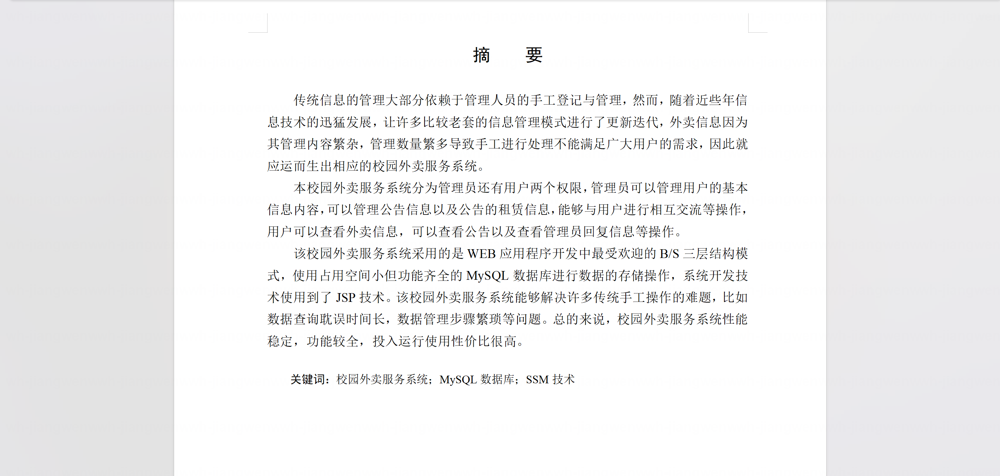

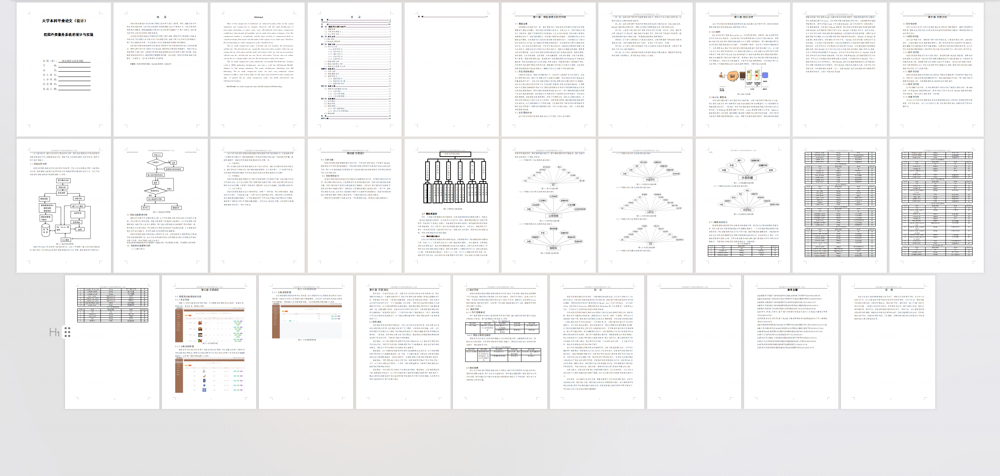

## 系统截图

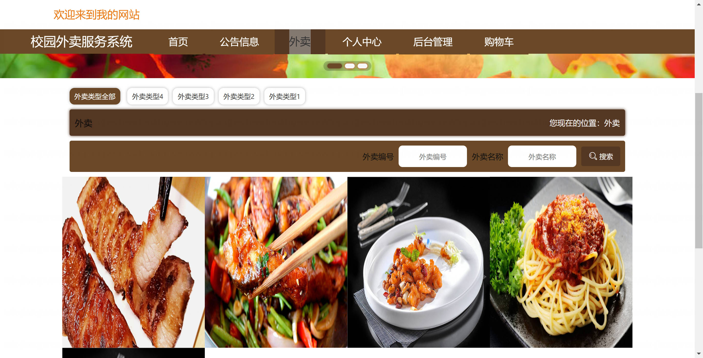

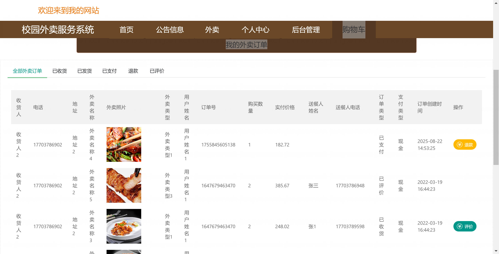

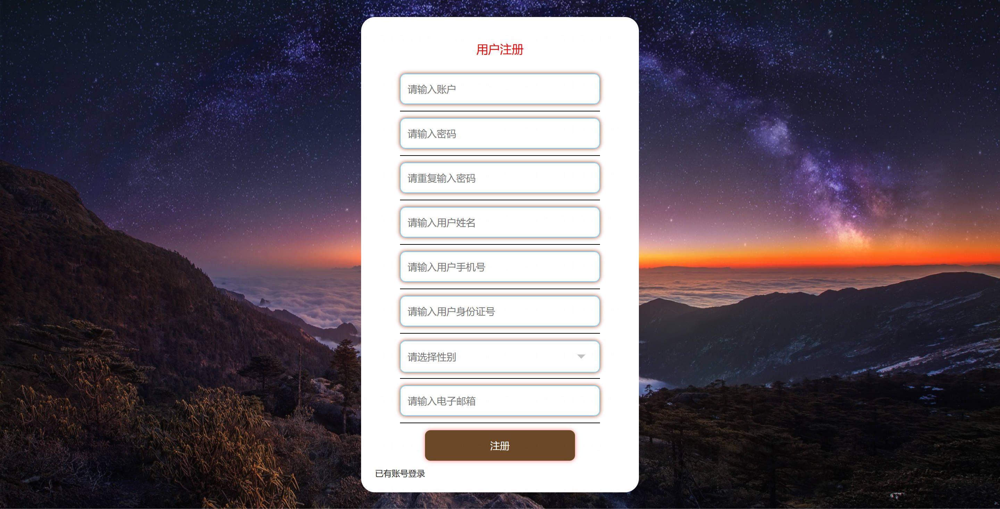

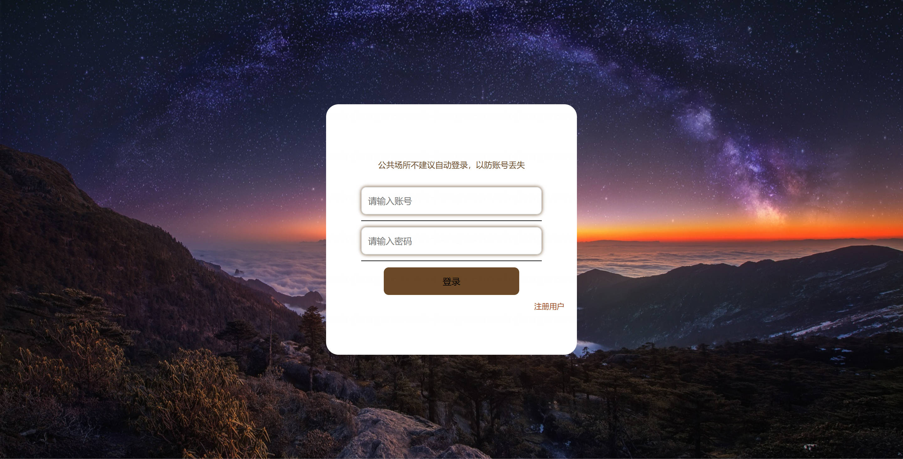

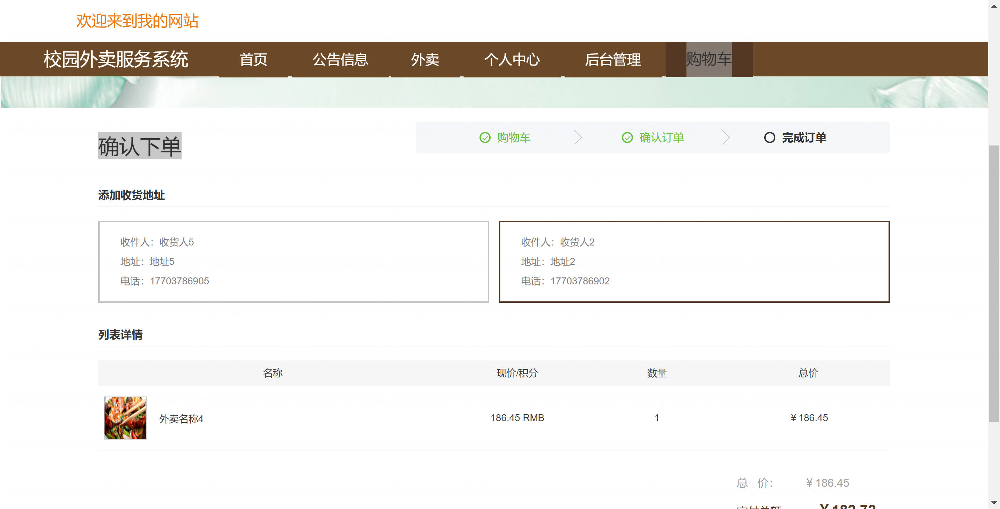

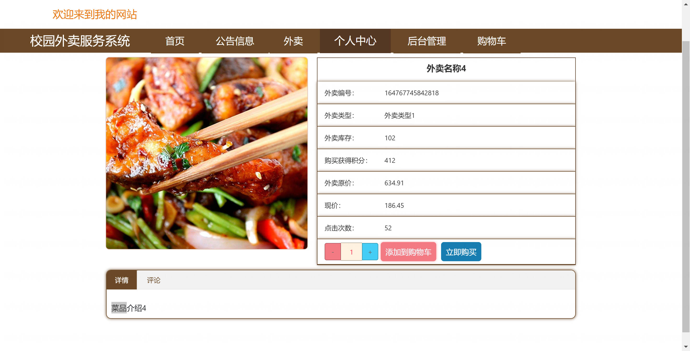

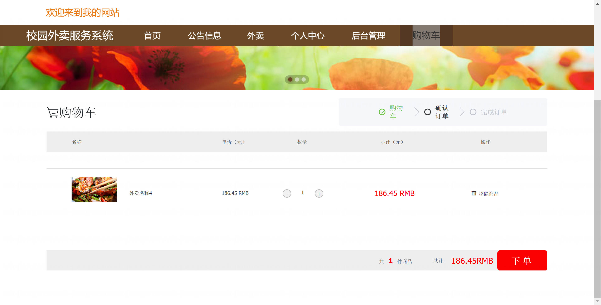

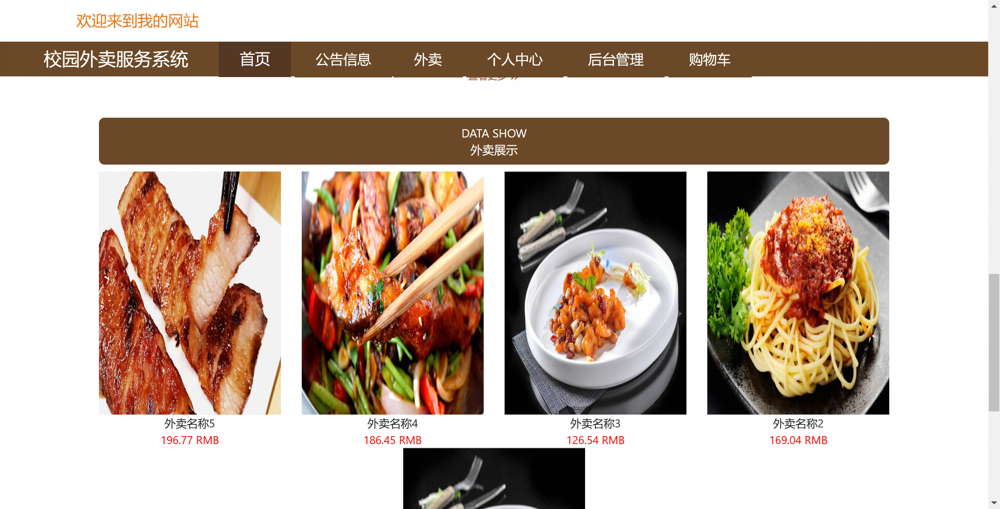

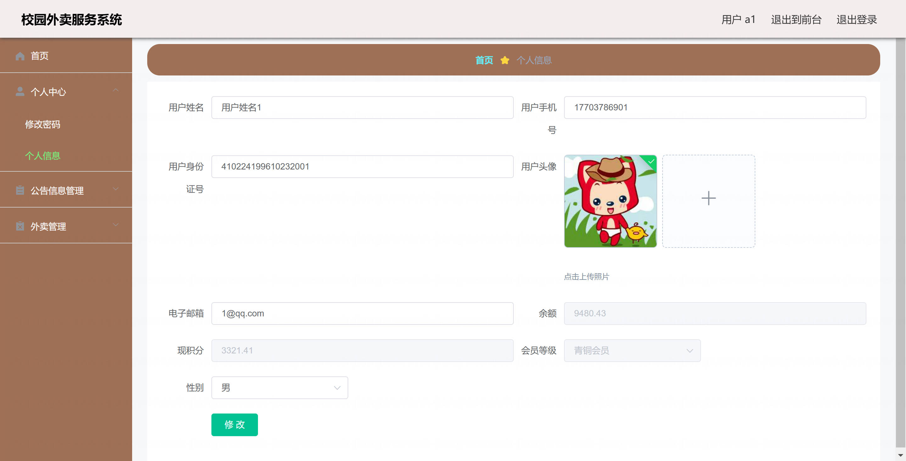

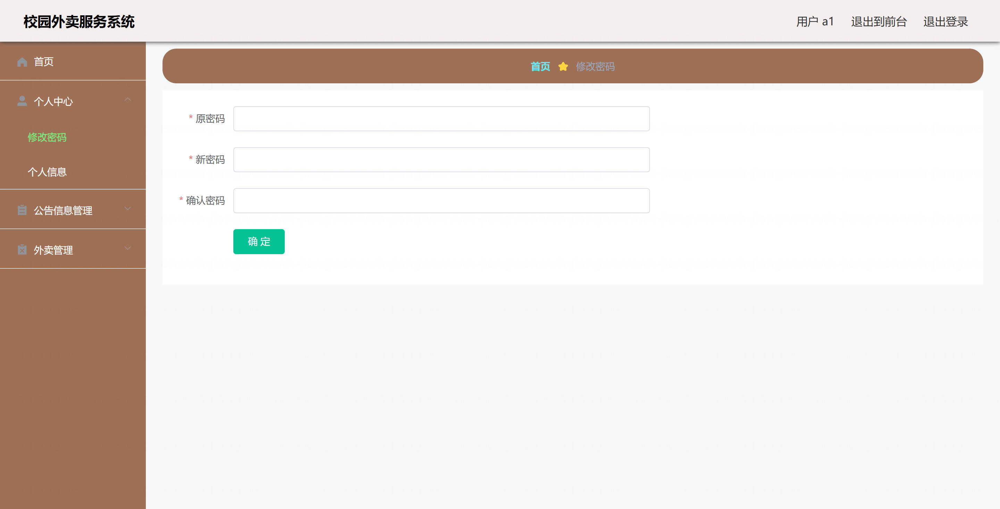